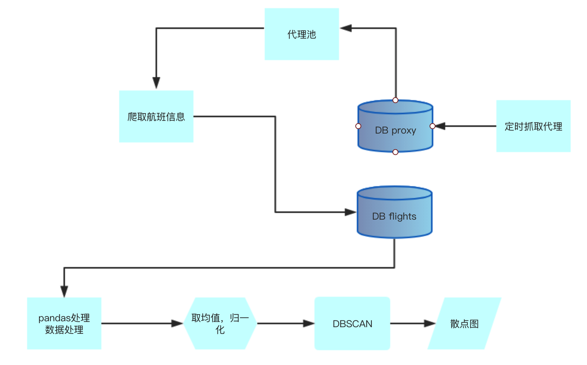

## 机器学习实践---利用聚类算法技术找到低价机票
 > 本文实现参考《机器学习从认知到实践》
 声明:此项目学习参考，用于其他用途造成的后果本人概不负责
## 背景
如何识别是低价票呢？常规的思路是当票价比某个阈值小，那么这就是低价票。然而机票的价格随时在浮动，显然在某个时刻取阈值用于之后的对比识别是很不科学的， 所以选择聚类算法.这里使用的是[DBSCAN(基于密度的空间聚类算法)](https://baike.baidu.com/item/DBSCAN/4864716?fr=aladdin),该算法属于非监督的聚类算法,常用于识别点集群。DBSCAN算法有两个重要的参数epsilon和最小点数,epsilon值代表同一个聚类中两个点之间的距离,最小点数代表创建一个聚类所需要的最小数目,这里我们设置最小点数=1，符合我们的实际场景。 通过该算法我们可以把平时的”正常票价“归为一个簇，当出现"低价票"的时候,会形成新的簇,从不同聚类中找出各自的最低票价,之后再进行对比,由此可以找到最低票价。
## 流程步骤图
以下是该项目的运行步骤图
 
## 数据获取
 我爬取了某牛2018-12-29号往后的3个月北京到上海的机票价格 ,共计6682条数据,然后存至mysql数据库。数据爬取部分采用selenuim浏览器自动化测试工具,构建一个headless浏览器发送请求之后得到html, 然后再提取和航班相关的信息。为了防止爬虫被河蟹, 每次发送的网络请求都设置代理, 而每次代理都是从代理池里面随机取的。因为代理池里的ip并不是固定的ip, 有时效性,所以代理池也是使用爬虫定时爬取并且实时更新。
 下面的代码是获取机票信息, 有简单的并有简单的注解
 
```python
from selenium import webdriver
import time
import arrow
import random
import pymysql
import uuid
import os
from selenium.webdriver.support.wait import WebDriverWait
from selenium.common.exceptions import TimeoutException
from selenium.webdriver.support import expected_conditions as EC
from selenium.webdriver.common.by import By

def getThreeMonthArr():
# 获取从当前时间开始的三个月组成的数组 , 数组的每一项为日期,eg: 2018-12-28
    res= []
    startDay = arrow.now().shift(days=1)
    endDayString = startDay.shift(months=3).format('YYYY-MM-DD')
    countDay = startDay
    while(countDay.format('YYYY-MM-DD')!=endDayString):
        res.append(countDay.format('YYYY-MM-DD'))
        countDay = countDay.shift(days=1)
    return res

def writeToDataBase(price, airCompany, startHour, endHour, startAirPort, endAirPort,  onTimeRate, durationTime, day,cursor, db):
# 把航班信息写入数据库
    print(price, airCompany, startHour, endHour, startAirPort, endAirPort,  onTimeRate, durationTime)
    sql= "INSERT INTO flights(id, price, air_company, duration_time, on_time_rate, start_hour, end_hour, start_air_port, end_air_port, day) VALUES(%s,%s, %s, %s, %s, %s, %s, %s, %s, %s)" 
    try:
        cursor.execute(sql, (str(uuid.uuid1()), price, airCompany, durationTime, onTimeRate, startHour, endHour, startAirPort, endAirPort, day))
        db.commit()
    except:
        db.rollback()
    pass

def getPage(day, cursor ,db):
    sql = "SELECT ip, port, validate_time FROM  proxy ORDER BY validate_time DESC LIMIT 20 "
    cursor.execute(sql)
    proxys = cursor.fetchall()
    # 随机从数据库里取出一个代理
    proxy = random.choice(proxys)
    print(proxy)
    # 浏览器的一些设置
    profile = webdriver.FirefoxProfile()
    option = webdriver.FirefoxOptions()
    option.set_headless(headless=True)
    profile.set_preference('network.proxy.type', 1)
    profile.set_preference('permissions.default.image', 0)
    profile.set_preference('permissions.default.stylesheet', 0)
    profile.set_preference('dom.ipc.plugins.enabled.libflashplayer.so','false')
    profile.set_preference('network.proxy.http',proxy[0])
    profile.set_preference('network.proxy.http_port',proxy[1])
    profile.update_preferences()
    # 构建无头浏览器
    driver = webdriver.Firefox(executable_path="./geckodriver", firefox_profile=profile)
    driver.set_window_size(1366,768)
    driver.set_page_load_timeout(30)
    flights= []
    try:
        driver.get("http://flight.tuniu.com/domestic/list/BJS_SHA_ST_1_0_0?deptDate="+day)
    except:
        print("超时")
        deleteSql = "DELETE FROM proxy WHERE ip = %s"
        cursor.execute(deleteSql,(proxy[0]))
        db.commit()
        driver.quit()  
        getPage(day, cursor, db)
        return  
    flights = driver.find_elements_by_class_name("J-flightlist")
    driver.save_screenshot("tuniu.png")
    # 处理航班信息
    for flight in flights:
        price = flight.find_element_by_class_name("num").text
        airCompany  = flight.find_element_by_class_name("aircom").text
        hours = flight.find_elements_by_class_name("hours")
        ariport = flight.find_elements_by_class_name("airport")
        durationTime = flight.find_element_by_class_name("durationTime").text
        onTimeRateOuter =  flight.find_element_by_class_name("rateWrap")
        onTimeRate = onTimeRateOuter.find_element_by_tag_name("li").text
        startHour = hours[0].text
        endHour = hours[1].text
        startAirPort = ariport[0].text
        endAirPort = ariport[1].text
        # 写入数据库
        writeToDataBase(price, airCompany, startHour, endHour, startAirPort, endAirPort, onTimeRate, durationTime, day, cursor,db)
    # 销毁浏览器    
    driver.quit()   
    pass
def mainFunc():
    days = getThreeMonthArr()
    db = pymysql.connect("localhost","root", "mysql", "flights")
    cursor = db.cursor()
    for day in days:
      print(day)
      getPage(day, cursor, db)
      time.sleep(random.randint(2,3))
    db.close() 
    pass        
mainFunc()
```
首先分析网站的请求机票的详情页面，通过chrome控制台开发者工具审查元素可以看到航班的信息被类名为"J-flightlist"的div包裹,通过find_elements_by_class_name可以取得所有航班的信息,之后就是对具体的信息进行提取,然后写入数据库以备之后的调用。
## 数据处理
这里在爬取的数据中找出每天的最低价，然后把处理之后的数据通过pandas构建数据框。目前我们关心的是价格,所以构建prices数据框,然后设置索引。之后用StandardScaler去均值和方差归一化数据预处理，主要是考虑到样本中的数据可能出现方差大而导致模型正常训练的情况, 方差大表现在会出现一些异常小和异常大的数据和数据分布的很散。之后就是构建DBSCAN对象,在进行模型拟合。之后再绘制散点图。

```python
import numpy as np
import pandas as pd
import matplotlib.pyplot as plt
import pymysql
from sklearn.cluster import DBSCAN
from sklearn.preprocessing import StandardScaler

def getLowestPriceForADay(data):
    # 找出一天的最低价
    res = []
    tmp = {}
    currrentDay = ""
    for item in data: 
         if currrentDay==item['day']:
             tmp[currrentDay].append(item)
         else:
             currrentDay = item['day']
             tmp[currrentDay] = []
             tmp[currrentDay].append(item)
    for key in tmp:
        res.append(sorted(tmp[key], key=lambda x: x['price'])[0])
    return res 

db = pymysql.connect("localhost","root", "mysql", "flights", cursorclass = pymysql.cursors.DictCursor, charset='utf8')
cursor = db.cursor()
sql = "SELECT * FROM flights ORDER BY day ASC"
cursor.execute(sql)
data = getLowestPriceForADay(cursor.fetchall())
db.close()
df = pd.DataFrame(data)
prices = [x for x in df['price']]
ff = pd.DataFrame(prices, columns=['price']).reset_index()
# StandardScaler去均值和方差归一化数据预处理
X = StandardScaler().fit_transform(ff)
# 模型拟合
dbscan = DBSCAN(eps=0.5, min_samples=1).fit(X)
labels = dbscan.labels_
uniq_labels = set(labels)
clusters = len(set(labels))
# 为每一种label设置不同的颜色
colors = plt.cm.Spectral(np.linspace(0,1,len(uniq_labels)))
# 绘制散点图
plt.subplots(figsize=(12,8))
for k , c in zip(uniq_labels,colors):
    class_member_mask =(labels ==k)
    xy = X[class_member_mask]
    plt.plot(xy[:, 0], xy[:, 1], 'o', markerfacecolor=c, markeredgecolor='k', markersize=14)
    plt.title("total clusters:{}".format(clusters), fontsize=14, y=1.01) 
plt.show()       

```
执行代码我们可以看到生成的散点图，此时的eps为0.5，此时有9个簇
 
 逐渐调大eps的值，当增值1.5,我得到一个簇， 为了看出现价格异常是否能生成新的簇，我设置price[0] =150,  此时运行代码看到，异常的票价形成自己的簇。
 
